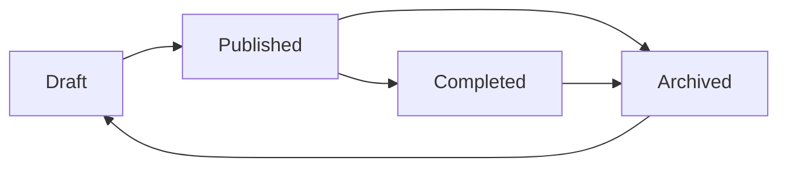

# Feed Life - Система меню и взаимодействие с постами

## Обзор системы

Система `Feed Life` представляет собой комплексное решение для управления постами в социальной ленте с расширенным функционалом dropdown меню и различными типами постов. 

### Основные типы постов:
- **Advertising** - рекламные посты
- **TimeSlot** - временные слоты
- **Job Search** - поиск работы
- **Task** - задачи различных типов

## Модель Task - основа системы

### 1. Структура модели Task

```python
class Task(models.Model):
    TASK_MODE_CHOICES = [
        ('draft', 'Draft'),           # Черновик
        ('published', 'Published'),   # Опубликовано
        ('archived', 'Archived'),     # Архивировано
    ]
    
    # Основные поля
    id = models.AutoField(primary_key=True)
    type_of_task = models.ForeignKey('TypeOfTask', on_delete=models.CASCADE)
    title = models.CharField(max_length=120)
    description = models.TextField(max_length=5000, blank=True, null=True)
    
    # Временные параметры
    date_start = models.DateField(null=True, blank=True)
    date_end = models.DateField(null=True, blank=True)
    time_start = models.TimeField(null=True, blank=True)
    time_end = models.TimeField(null=True, blank=True)
    
    # Статус и режим
    task_mode = models.CharField(max_length=10, choices=TASK_MODE_CHOICES, default='draft')
    status = models.ForeignKey('TaskStatus', on_delete=models.SET_NULL, null=True)
    
    # Настройки видимости
    is_private = models.BooleanField(default=False)
    disclose_name = models.BooleanField(default=False)
    hidden = models.BooleanField(default=False)
    is_published = models.BooleanField(default=False)
    
    # Связи
    hashtags = models.ManyToManyField('joblist.AllTags', through='TaskHashtagRelations')
    performers = models.ManyToManyField(User, through='PerformersRelations')
    photos = models.ManyToManyField('PhotoRelations', related_name='tasks')
    services = models.ManyToManyField('Services', through='ServicesRelations')
```

### 2. Типы задач (TypeOfTask)

Система поддерживает три основных типа задач:

#### **Tender** (Тендер)
- **Назначение**: Публичные конкурсы и закупки
- **Особенности**: 
  - Открытые для всех исполнителей
  - Фиксированные сроки подачи заявок
  - Прозрачные условия и требования
- **Использование**: Поиск исполнителей для конкретных проектов

#### **Project** (Проект)
- **Назначение**: Долгосрочные проекты и сотрудничество
- **Особенности**:
  - Может быть как публичным, так и приватным
  - Гибкие сроки и условия
  - Возможность создания подзадач (subtasks)
- **Использование**: Управление сложными проектами с множественными этапами

#### **My Task** (Моя задача)
- **Назначение**: Личные задачи пользователя
- **Особенности**:
  - Приватные задачи для личного использования
  - Возможность скрытия от других пользователей
  - Персональное управление и отслеживание
- **Использование**: Организация личной работы и планирование

### 3. Жизненный цикл задач



#### **Draft (Черновик)**
- Задача создана, но не опубликована
- Видна только создателю
- Возможность редактирования и настройки

#### **Published (Опубликовано)**
- Задача доступна для просмотра и участия
- Видна всем (если не приватная)
- Возможность подачи заявок исполнителями

#### **Archived (Архивировано)**
- Задача скрыта из активной ленты
- Сохраняется в базе данных
- Возможность восстановления в draft

### 4. Связи и отношения

#### **Hashtag Relations**
```python
class TaskHashtagRelations(models.Model):
    task = models.ForeignKey('Task', on_delete=models.CASCADE)
    hashtag = models.ForeignKey('joblist.AllTags', on_delete=models.CASCADE)
    
    class Meta:
        unique_together = ('task', 'hashtag')
```

#### **Performers Relations**
```python
class PerformersRelations(models.Model):
    task = models.ForeignKey('Task', on_delete=models.CASCADE)
    performer = models.ForeignKey(User, on_delete=models.CASCADE)
    # Дополнительные поля для отношений исполнитель-задача
```

#### **Photo Relations**
```python
class PhotoRelations(models.Model):
    task = models.ForeignKey('Task', on_delete=models.CASCADE)
    photo = models.ForeignKey('Photo', on_delete=models.CASCADE)
    # Связь задач с изображениями
```

## Архитектура системы

### 1. Основные компоненты

#### Advertising Feed (`advertising_feed.js`)
- **Назначение**: Управление рекламными постами
- **Основные функции**: 
  - Открытие/закрытие dropdown меню
  - Архивирование/разархивирование постов
  - Публикация/снятие с публикации
  - Редактирование и удаление постов

#### TimeSlot Feed (`timeslot_feed.js`)
- **Назначение**: Управление постами временных слотов
- **Основные функции**:
  - Управление избранным (favorites)
  - Бронирование временных слотов
  - Анимации и UI эффекты

#### Job Search Feed (`job_search_feed.js`)
- **Назначение**: Управление постами поиска работы
- **Основные функции**:
  - Запуск поиска работы
  - Управление активностями
  - Сохранение заметок

#### Task Management System
- **Назначение**: Управление задачами (Tender, Project, My Task)
- **Основные функции**:
  - Создание и редактирование задач
  - Управление статусами и режимами
  - Работа с исполнителями и заявками
  - Управление хештегами и категориями

### 2. Структура HTML

#### Advertising Post Structure
```html
<div class="social_feed" data-post-id="{{ advertising.id }}" data-post-type="advertising">
    <!-- Header с пользователем и меню -->
    <div class="social_feed_user_name">
        <div class="advertising_social_feed_menu">
            <!-- Кнопка меню -->
            <button class="advertising_social_feed_menu_trigger" id="menu_trigger_{{ advertising.id }}">
                <svg>⋮</svg>
            </button>
            <!-- Dropdown меню -->
            <div class="advertising_social_feed_overflow_menu" id="overflow_menu_{{ advertising.id }}">
                <!-- Пункты меню в зависимости от статуса -->
            </div>
        </div>
    </div>
    
    <!-- Контент поста -->
    <div class="social_feed_text">{{ advertising.description }}</div>
    <div class="social_feed_image_gallery_1">
        <!-- Галерея изображений -->
    </div>
    
    <!-- Действия -->
    <div class="post_actions">
        <button class="action_btn">Chat</button>
        <button class="action_btn">Comments</button>
        <button class="order_now">Order now</button>
    </div>
</div>
```

#### Task Post Structure
```html
<div class="social_feed" data-post-id="{{ task.id }}" data-post-type="task" data-task-type="{{ task.type_of_task.name }}">
    <!-- Header с пользователем и меню -->
    <div class="social_feed_user_name">
        <div class="task_social_feed_menu">
            <!-- Кнопка меню -->
            <button class="task_social_feed_menu_trigger" id="menu_trigger_{{ task.id }}">
                <svg>⋮</svg>
            </button>
            <!-- Dropdown меню -->
            <div class="task_social_feed_overflow_menu" id="overflow_menu_{{ task.id }}">
                <!-- Пункты меню в зависимости от task_mode -->
                
                    <div class="menu_item publish" data-action="publish">Publish</div>
                
                    <div class="menu_item archive" data-action="archive">Archive</div>
                    <div class="menu_item edit" data-action="edit">Edit</div>
                
                    <div class="menu_item unarchive" data-action="unarchive">Unarchive</div>
                    <div class="menu_item remove" data-action="remove">Remove</div>
                
            </div>
        </div>
    </div>
    
    <!-- Информация о задаче -->
    <div class="task_info">
        <div class="task_type_badge {{ task.type_of_task.name|lower }}">
            {{ task.type_of_task.name }}
        </div>
        <div class="task_dates">
            <span class="start_date">{{ task.date_start|date:'d.m.Y' }}</span>
            <span class="end_date">{{ task.date_end|date:'d.m.Y' }}</span>
        </div>
    </div>
    
    <!-- Контент задачи -->
    <div class="social_feed_text">{{ task.description }}</div>
    
    <!-- Хештеги -->
    <div class="social_feed_tags">
        
            <span class="tag">{{ hashtag.tag }}</span>
        
    </div>
    
    <!-- Действия -->
    <div class="post_actions">
        <button class="action_btn">Apply</button>
        <button class="action_btn">Details</button>
        
            <button class="tender_btn">Submit Proposal</button>
        
    </div>
</div>
```

## Система Dropdown Меню

### 1. Принцип работы

#### ID-ориентированный подход
- Каждый пост имеет уникальный `data-post-id`
- Кнопка меню: `menu_trigger_{postId}`
- Dropdown меню: `overflow_menu_{postId}`
- Все взаимодействия происходят через ID, а не CSS классы

#### Состояния постов
```javascript
// Для archived постов
if (advertising.adv_mode == 'archived') {
    // Показываем: Unarchive, Remove
} else {
    // Показываем: Publish, Archive
}

// Для задач
if (task.task_mode == 'archived') {
    // Показываем: Unarchive, Remove
} else if (task.task_mode == 'published') {
    // Показываем: Archive, Edit
} else if (task.task_mode == 'draft') {
    // Показываем: Publish, Edit
}
```

### 2. Жизненный цикл dropdown

#### Открытие меню
```javascript
function openDropdownById(postId) {
    const dropdown = getOverflowMenuById(postId);
    if (dropdown) {
        // Закрываем предыдущий открытый dropdown
        if (activeDropdown && activeDropdown !== dropdown) {
            activeDropdown.classList.remove('show');
        }
        
        dropdown.classList.add('show');
        activeDropdown = dropdown;
    }
}
```

#### Закрытие меню
```javascript
function closeDropdownById(postId) {
    const dropdown = getOverflowMenuById(postId);
    if (dropdown) {
        dropdown.classList.remove('show');
        if (activeDropdown === dropdown) {
            activeDropdown = null;
        }
    }
}
```

#### Автозакрытие при клике вне
```javascript
document.addEventListener('click', function(e) {
    if (!e.target.closest('.advertising_social_feed_menu_trigger') && 
        !e.target.closest('.advertising_social_feed_overflow_menu')) {
        closeAllDropdowns();
    }
});
```

### 3. CSS стили dropdown

#### Базовые стили
```css
.advertising_social_feed_overflow_menu {
    position: absolute;
    top: 100%;
    right: 0;
    background: white;
    border: 1px solid #e0e0e0;
    border-radius: 8px;
    box-shadow: 0 4px 12px rgba(0, 0, 0, 0.15);
    min-width: 120px;
    z-index: 9999;
    display: none;
    overflow: hidden;
    transition: all 0.2s ease;
    margin-top: 5px;
    opacity: 0;
    transform: translateY(-10px);
}
```

#### Состояние показа
```css
.advertising_social_feed_overflow_menu.show {
    display: block;
    opacity: 1;
    transform: translateY(0);
}
```

## Взаимодействие с постами

### 1. Типы действий

#### Архивирование
```javascript
function handleArchiveClick(postId) {
    const csrfToken = getCookie('csrftoken');
    
    // Показываем спиннер
    const post = getPostById(postId);
    const originalContent = post.innerHTML;
    post.innerHTML = `<div class="loading">Archiving post...</div>`;
    
    // Отправляем запрос
    fetch(`/services_and_projects/change_advertising_status/${postId}/`, {
        method: 'POST',
        headers: {
            'Content-Type': 'application/x-www-form-urlencoded',
            'X-CSRFToken': csrfToken,
        },
        body: `adv_mode=archived`
    })
    .then(response => response.json())
    .then(data => {
        if (data.success) {
            // Скрываем пост из ленты
            post.style.display = 'none';
            closeDropdownById(postId);
        } else {
            // Восстанавливаем контент
            post.innerHTML = originalContent;
        }
    });
}
```

#### Публикация
```javascript
function handlePublishClick(postId) {
    // Аналогично архивированию, но с adv_mode=published
}
```

#### Разархивирование
```javascript
function handleUnarchiveClick(postId) {
    // Возвращаем в draft: adv_mode=draft
}
```

### 2. Обработка ошибок

#### Fallback уведомления
```javascript
if (typeof alertify !== 'undefined' && alertify && alertify.notify) {
    alertify.notify('Post archived successfully!', 'success');
} else {
    alert('Post archived successfully!');
}
```

#### Восстановление состояния
```javascript
.catch(error => {
    console.error('Error:', error);
    // Восстанавливаем оригинальный контент
    post.innerHTML = originalContent;
    // Показываем ошибку
});
```

## Система уведомлений

### 1. Alertify интеграция
- Красивые уведомления в правом верхнем углу
- Автоматическое скрытие через 3 секунды
- Fallback на стандартные `alert()` при недоступности

### 2. Типы уведомлений
- **Success**: Зеленые уведомления об успешных операциях
- **Error**: Красные уведомления об ошибках
- **Warning**: Желтые предупреждения
- **Info**: Синие информационные сообщения

## Защита от повторной загрузки

### 1. Глобальные флаги
```javascript
if (!window.__AdvertisingFeedBootstrapped__) {
    window.__AdvertisingFeedBootstrapped__ = true;
    // Инициализация
}
```

### 2. Проверка существования конфигурации
```javascript
if (window.TIMESLOT_FEED_CONFIG) {
    // TimeSlot Feed already loaded, skipping...
} else {
    // Loading TimeSlot Feed...
}
```

## Утилиты и диагностика

### 1. AdvertisingFeedUtils
```javascript
window.AdvertisingFeedUtils = {
    getMenuTriggerById,
    getOverflowMenuById,
    getPostById,
    getAllPostIds,
    openDropdownById,
    closeDropdownById,
    closeAllDropdowns,
    testDropdown,      // Тестирование dropdown
    diagnosePage       // Диагностика страницы
};
```

### 2. Функции диагностики
```javascript
function diagnosePage() {
    console.log('=== PAGE DIAGNOSIS ===');
    console.log('All social_feed elements:', document.querySelectorAll('.social_feed'));
    console.log('All menu trigger elements:', document.querySelectorAll('.advertising_social_feed_menu_trigger'));
    console.log('All dropdown elements:', document.querySelectorAll('.advertising_social_feed_overflow_menu'));
    
    // Проверяем каждый пост
    const posts = document.querySelectorAll('.social_feed[data-post-id]');
    posts.forEach((post, index) => {
        const postId = post.dataset.postId;
        console.log(`\n--- Post ${index + 1} (ID: ${postId}) ---`);
        console.log('Post element:', post);
        console.log('Menu trigger:', getMenuTriggerById(postId));
        console.log('Dropdown:', getOverflowMenuById(postId));
        console.log('Post data attributes:', post.dataset);
    });
}
```

## Лучшие практики

### 1. Производительность
- Использование ID вместо CSS селекторов для быстрого поиска
- Делегирование событий на уровне документа
- Защита от повторной загрузки скриптов

### 2. Надежность
- Проверка существования объектов перед использованием
- Fallback механизмы для критических функций
- Обработка ошибок с восстановлением состояния

### 3. UX
- Плавные анимации открытия/закрытия
- Автозакрытие при клике вне меню
- Визуальная обратная связь (спиннеры, уведомления)

## Отладка и тестирование

### 1. Консольные команды
```javascript
// Диагностика страницы
AdvertisingFeedUtils.diagnosePage();

// Тестирование конкретного dropdown
AdvertisingFeedUtils.testDropdown(123);

// Закрытие всех dropdown
AdvertisingFeedUtils.closeAllDropdowns();
```

### 2. Тестовые кнопки
- В режиме разработки автоматически добавляются кнопки тестирования
- Позиционирование: правый верхний угол
- Функции: Test Dropdown, Diagnose Post

## Заключение

Система `Feed Life` представляет собой хорошо структурированное решение для управления социальной лентой с:

- **Модульной архитектурой** для разных типов постов
- **ID-ориентированным подходом** для производительности
- **Надежной системой dropdown меню** с защитой от ошибок
- **Комплексной системой уведомлений** с fallback механизмами
- **Инструментами диагностики** для разработки и отладки
- **Поддержкой различных типов задач**: Tender, Project, My Task

Система готова к расширению новыми типами постов и функциональностью, сохраняя при этом высокую производительность и надежность.
