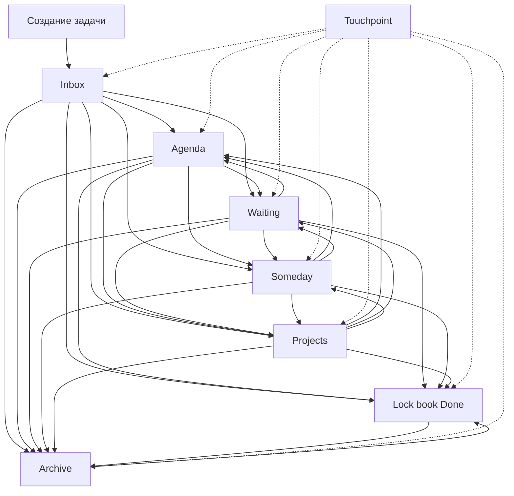
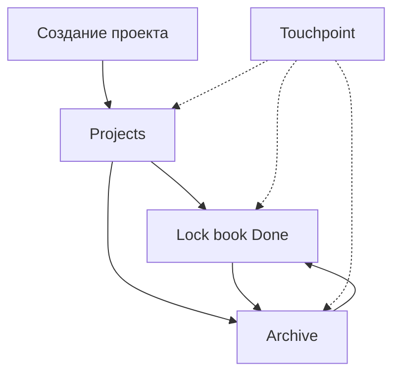

# Feed Life - Система меню и взаимодействие с постами задачами и проектами.

## Обзор системы

Система `Feed Life` 

### Основные типы отображаемых елементов:
Персонально
- **Task** - задачи
- **Project** - проекты
Публично - посты
- **Announcement** - рекламные посты 
- **Time slot** - временные слоты

## Модель Task - основа системы

### 1. Структура модели Task

```python
class Task(models.Model):
    TASK_MODE_CHOICES = [
        ('draft', 'Draft'),           # Черновик
        ('published', 'Published'),   # Опубликовано
        ('archived', 'Archived'),     # Архивировано
    ]
    
    # Основные поля
    id = models.AutoField(primary_key=True)
    type_of_task = models.ForeignKey('TypeOfTask', on_delete=models.CASCADE)
    title = models.CharField(max_length=120)
    description = models.TextField(max_length=5000, blank=True, null=True)
    photo_link = models.CharField(max_length=2000, blank=True, null=True)
    
    # Временные параметры
    created_at = models.DateTimeField(auto_now_add=True)
    updated_at = models.DateTimeField(auto_now=True)
    date_start = models.DateField(null=True, blank=True)
    date_end = models.DateField(null=True, blank=True)
    time_start = models.TimeField(null=True, blank=True)
    time_end = models.TimeField(null=True, blank=True)
    
    # Статус и режим
    task_mode = models.CharField(max_length=10, choices=TASK_MODE_CHOICES, default='draft', verbose_name='Task mode')
    status = models.ForeignKey('TaskStatus', on_delete=models.SET_NULL, null=True)
    
    # Настройки видимости
    is_private = models.BooleanField(default=False)
    disclose_name = models.BooleanField(default=False)
    hidden = models.BooleanField(default=False)
    is_published = models.BooleanField(default=False)
    
    # Дополнительные поля
    documents = models.CharField(max_length=2000, blank=True, null=True)
    note = models.TextField(max_length=10000, blank=True, null=True)
    finance = models.ForeignKey('Finance', on_delete=models.SET_NULL, null=True, blank=True)
    parent = models.ForeignKey('self', on_delete=models.CASCADE, null=True, blank=True, related_name='subtasks')
    
    # Связи
    hashtags = models.ManyToManyField('joblist.AllTags', through='TaskHashtagRelations', blank=True)
    performers = models.ManyToManyField(User, through='PerformersRelations', blank=True)
    comments = models.ManyToManyField('Comment', through='CommentTaskRelations', blank=True)
    photos = models.ManyToManyField('PhotoRelations', blank=True, related_name='tasks')
    services = models.ManyToManyField('Services', through='ServicesRelations', blank=True)

    def __str__(self):
        return self.title

    class Meta:
        verbose_name = "Task"
        verbose_name_plural = "Tasks"

    def delete(self, *args, **kwargs):
        related_photos = list(self.photos.all())
        super().delete(*args, **kwargs)
        for photo in related_photos:
            photo.delete()
```

### 2. Типы задач (TypeOfTask)

Система поддерживает три основных типа задач:

#### **Tender** (Тендер)
- **Назначение**: Публичные конкурсы на выполнение больших заданий исполнителями
- **Особенности**: 
  - Открытые для всех исполнителей
  - Фиксированные сроки подачи заявок
  - Прозрачные условия и требования
- **Использование**: Поиск исполнителей для конкретных проектов

#### **Project** (Проект)
- **Назначение**: Долгосрочные проекты 
- **Особенности**:
  - Может быть как публичным, так и приватным
  - Возможность скрытия от других пользователей
  - Гибкие сроки и условия
  - Возможность создания подзадач (subtasks)
- **Использование**: Управление сложными проектами с множественными этапами

#### **Task** (Моя задача)
- **Назначение**: Личные задачи пользователя
- **Особенности**:
  - Приватные задачи для личного использования
  - Изначально после создания личная таска
  - Персональное управление и отслеживание
- **Использование**: Организация личной работы и планирование

### 3. Жизненный цикл объектов в Task Tracker

#### 3.1. Категории и подкатегории

**Основные категории:**
- **Touchpoint** - контакты и связи
- **Inbox** - входящие задачи и проекты
- **Agenda** - просмотр задач в расписании
- **Waiting** - задачи в ожидании от выполнения кем то - кому делегировано
- **Someday** - задачи на будущее
- **Projects** - активные проекты
- **Lock book (Done)** - завершенные задачи и проекты
- **Archive** - архивированные объекты 

**Подкатегории:**
- **Touchpoint**: Contacts
- **Inbox**: Tasks, Projects, Favorites
- **Waiting**: in progress, Orders, Subscriptions, Published
- **Lock book (Done)**: Projects, Tasks
- **Archive**: Projects, Tasks

#### 3.2. Правила перемещения задач

**Задачи могут быть одновременно в нескольких категориях:**
- В категории **Touchpoint** И в одной из: Inbox, Agenda, Waiting, Someday, Projects, Lockbook (Done), Archive
- В категории **Projects** (внутри проекта) И в одной из: Inbox, Agenda, Waiting, Someday, Lockbook (Done), Archive

**Задачи могут быть только в одном экземпляре:**
- В одной из категорий: Inbox, Agenda, Waiting, Someday, Lockbook (Done), Archive
- Не могут дублироваться между этими категориями

#### 3.3. Правила перемещения проектов

**Проекты могут быть в одной категории:**
- В одной из: Projects, Done, Archive

**Проекты могут быть одновременно:**
- В категории **Touchpoint** И в категории **Projects**
- НЕ могут быть в Touchpoint если находятся в Done или Archive

#### 3.4. Жизненный цикл задач



#### 3.5. Жизненный цикл проектов



#### 3.6. Состояния объектов

**Draft (Черновик)**
- Объект создан, но не опубликован
- Виден только создателю
- Возможность редактирования, перемещения между категориями и настройки
- Находится в категории Inbox

**Published (Опубликовано)**
- Объект доступен для просмотра и участия
- Виден всем (если не приватный)
- Возможность подачи заявок исполнителями
- Может быть в любой категории кроме Draft

**Archived (Архивировано)**
- Объект скрыт из активной ленты
- Сохраняется в базе данных
- Возможность восстановления
- Находится в категории Archive

#### 3.7. API для перемещения

**Перемещение задачи:**


**Перемещение проекта:**


#### 3.8. Валидация перемещений

**Проверки для задач:**
- Задача не может быть одновременно в Inbox, Agenda, Waiting, Someday, Lock book Done, Archive
- Задача может быть в Touchpoint + одна из основных категорий
- Задача может быть в Projects + одна из основных категорий

**Проверки для проектов:**
- Проект не может быть одновременно в Projects, Lock book Done, Archive
- Проект может быть в Touchpoint только если не в Done/Archive
- Проект может быть в Touchpoint + Projects одновременно

### 4. Связи и отношения

#### **Hashtag Relations**
```python
class TaskHashtagRelations(models.Model):
    task = models.ForeignKey('Task', on_delete=models.CASCADE)
    hashtag = models.ForeignKey('joblist.AllTags', on_delete=models.CASCADE)
    
    class Meta:
        unique_together = ('task', 'hashtag')
```

#### **Performers Relations**
```python
class PerformersRelations(models.Model):
    task = models.ForeignKey('Task', on_delete=models.CASCADE)
    performer = models.ForeignKey(User, on_delete=models.CASCADE)
    # Дополнительные поля для отношений исполнитель-задача
```

#### **Photo Relations**
```python
class PhotoRelations(models.Model):
    task = models.ForeignKey('Task', on_delete=models.CASCADE)
    photo = models.ForeignKey('Photo', on_delete=models.CASCADE)
    # Связь задач с изображениями
```

## Архитектура системы

### 1. Основные компоненты

#### Advertising Feed (`advertising_feed.js`)
- **Назначение**: Управление рекламными постами
- **Основные функции**: 
  - Открытие/закрытие dropdown меню
  - Архивирование/разархивирование постов
  - Публикация/снятие с публикации
  - Редактирование и удаление постов

#### TimeSlot Feed (`timeslot_feed.js`)
- **Назначение**: Управление постами временных слотов
- **Основные функции**:
  - Управление избранным (favorites)
  - Бронирование временных слотов
  - Анимации и UI эффекты

#### Job Search Feed (`job_search_feed.js`)
- **Назначение**: Управление постами поиска работы
- **Основные функции**:
  - Запуск поиска работы
  - Управление активностями
  - Сохранение заметок

#### Task Management System
- **Назначение**: Управление задачами (Tender, Project, Task)
- **Основные функции**:
  - Создание и редактирование задач
  - Управление статусами и режимами
  - Работа с исполнителями и заявками
  - Управление хештегами и категориями

### 2. Структура HTML

#### Advertising Post Structure

#### Task Post Structure


#### Состояния постов
```javascript
// Для archived постов
if (advertising.adv_mode == 'archived') {
    // Показываем: Unarchive, Remove
} else {
    // Показываем: Publish, Archive
}

// Для задач
if (task.task_mode == 'archived') {
    // Показываем: Unarchive, Remove
} else if (task.task_mode == 'published') {
    // Показываем: Archive, Edit
} else if (task.task_mode == 'draft') {
    // Показываем: Publish, Edit
}
```

### 2. Жизненный цикл dropdown

#### Открытие меню

#### Закрытие меню


#### Автозакрытие при клике вне


### 3. CSS стили dropdown

#### Базовые стили


#### Состояние показа


## Взаимодействие с постами

### 1. Типы действий

#### Архивирование

#### Публикация

#### Разархивирование


### 2. Обработка ошибок

#### Fallback уведомления
```javascript
if (typeof alertify !== 'undefined' && alertify && alertify.notify) {
    alertify.notify('Post archived successfully!', 'success');
} else {
    alert('Post archived successfully!');
}
```

#### Восстановление состояния


## Система уведомлений

### 1. Alertify интеграция
- Красивые уведомления в правом верхнем углу
- Автоматическое скрытие через 3 секунды
- Fallback на стандартные `alert()` при недоступности

### 2. Типы уведомлений
- **Success**: Зеленые уведомления об успешных операциях
- **Error**: Красные уведомления об ошибках
- **Warning**: Желтые предупреждения
- **Info**: Синие информационные сообщения

## Защита от повторной загрузки

### 1. Глобальные флаги


### 2. Проверка существования конфигурации


## Утилиты и диагностика

### 1. AdvertisingFeedUtils


### 2. Функции диагностики


## Лучшие практики

### 1. Производительность


### 2. Надежность


### 3. UX


## Отладка и тестирование

### 1. Консольные команды


## Заключение
